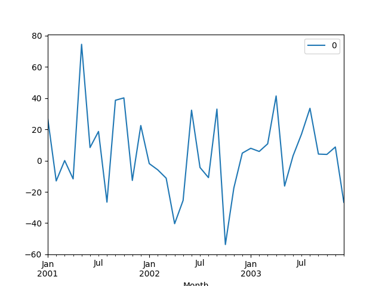
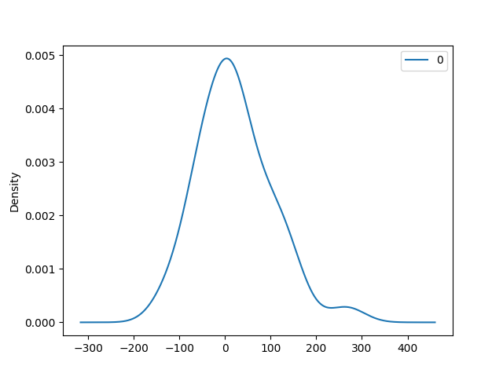
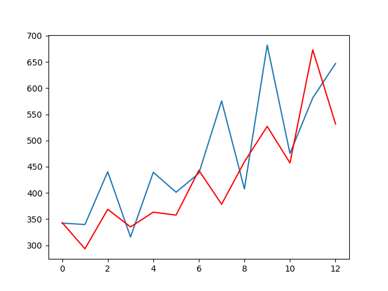

## ARIMA Time Series Prediction

An extensive documents on ARIMA Time series prediction is available at
* <https://machinelearningmastery.com/arima-for-time-series-forecasting-with-python/>
* <https://www.machinelearningplus.com/time-series/arima-model-time-series-forecasting-python/#:~:text=ARIMA%2C%20short%20for%20'AutoRegressive%20Integrated,to%20predict%20the%20future%20values.>


ARIMA is a forecasting algorithm that stands for 'AutoRegressive 
Integrated Moving Average'. It is the Idea that past values of a 
time series is relevant while predicting future values. The ARIMA
model is defined by three Values namely: p, d, and q.

where:

The order of the AR term is denoted by p.

The order of the MA term is denoted by q.

The differencing required to make the time series stationary is denoted by d.


### So, how do you make a series stationary?

The most common method is to differentiate it. To put it another way,
subtract the previous value from the current value. Depending on the 
complexity of the series, more than one differencing may be required at times.

As a result, the value of d is the smallest number of differencing 
required to make the series stationary. And d = 0 if the time series
is already stationary.

### What exactly are AR and MA models?

A pure Auto Regressive (AR only) model is one in which Yt is solely 
determined by its own lags. That is, Yt is a function of the 'Yt lags.'

```
Yt = \alpha +\beta 1Yt-1 + \beta2 Yt-2+ ... +\beta p Yt-p + \epsilon 1
```

'where $Yt-1$ is the series' lag1, $beta1$ is the lag1 coefficient 
estimated by the model, and $alpha$ is the intercept term estimated 
by the model.'


Similarly, a pure Moving Average (MA only) model is one in which Yt 
is determined solely by the lagged forecast errors.

``` 
Yt = \alpha +\epsilon t+\Phi 1\epsilon t-1 + \Phi 2\epsilon t-2 ... +\Phi q\epsilon t-q
```

where the error terms are the errors of the autoregressive models of 
the respective lags The errors Et and E(t-1) are the results of the 
following equations:

An ARIMA model is one in which the time series is different at least 
once to make it stationary and the AR and MA terms are combined. As a 
result, the equation is:

```
Yt = \alpha +\beta 1Yt-1 + \beta 2Yt-2 + ... + \beta pYt-p\epsilon t + \phi 1\epsilon t-1+phi 2\epsilon t-2+...+\phi q \epsilon t-q
```

'Predicted Yt = Constant + Linear combination Lags of Y (upto p lags) + 
Linear Combination of Lagged forecast errors (upto q lags)'

### ARIMA Python Implementation

This example is copied from [1]
``` python
from pandas import read_csv
from pandas import DataFrame
from statsmodels.tsa.arima.model import ARIMA
from matplotlib import pyplot


# load dataset
def parser(x):
    return datetime.strptime('190' + x, '%Y-%m')


series = read_csv('https://raw.githubusercontent.com/jbrownlee/Datasets/master/shampoo.csv', header=0, index_col=0, parse_dates=True, squeeze=True, date_parser=parser)
series.index = series.index.to_period('M')
# fit model
model = ARIMA(series, order=(5, 1, 0))
model_fit = model.fit()
# summary of fit model
print(model_fit.summary())
# line plot of residuals
residuals = DataFrame(model_fit.resid)
residuals.plot()
pyplot.show()
# density plot of residuals
residuals.plot(kind='kde')
pyplot.show()
# summary stats of residuals
print(residuals.describe())
```




### Rolling Forecast ARIMA Model

Given the reliance on observations in previous time steps for 
differencing and the AR model, a rolling forecast is required.
The ARIMA model is re-created after each new observation, which 
is a crude way to perform this rolling forecast.

Each iteration, we manually keep track of all observations in a 
list called history, which is seeded with the training data 
and to which new observations are appended.

Putting it all together, here's an example of a rolling forecast
in Python using the ARIMA model.

This example is copied from [1]
```python
from pandas import read_csv
from pandas import datetime
from matplotlib import pyplot
from statsmodels.tsa.arima.model import ARIMA
from sklearn.metrics import mean_squared_error
from math import sqrt


# load dataset
def parser(x):
    return datetime.strptime('190' + x, '%Y-%m')


series = read_csv('https://raw.githubusercontent.com/jbrownlee/Datasets/master/shampoo.csv', header=0, index_col=0, parse_dates=True, squeeze=True, date_parser=parser)
series.index = series.index.to_period('M')
# split into train and test sets
X = series.values
size = int(len(X) * 0.66)
train, test = X[0:size], X[size:len(X)]
history = [x for x in train]
predictions = list()
# walk-forward validation
for t in range(len(test)):
    model = ARIMA(history, order=(5, 1, 0))
    model_fit = model.fit()
    output = model_fit.forecast()
    yhat = output[0]
    predictions.append(yhat)
    obs = test[t]
    history.append(obs)
    print('predicted=%f, expected=%f' % (yhat, obs))
# evaluate forecasts
rmse = sqrt(mean_squared_error(test, predictions))
print('Test RMSE: %.3f' % rmse)
# plot forecasts against actual outcomes
pyplot.plot(test)
pyplot.plot(predictions, color='red')
pyplot.show()
```


### Dataset:
* <https://raw.githubusercontent.com/jbrownlee/Datasets/master/shampoo.csv>

### Reference
* [1]  Create an ARIMA Model for Time Series <https://machinelearningmastery.com/arima-for-time-series-forecasting-with-python/>
* [2] ARIMA Model – Complete Guide to Time Series Forecasting in Python <https://www.machinelearningplus.com/time-series/arima-model-time-series-forecasting-python/#:~:text=ARIMA%2C%20short%20for%20'AutoRegressive%20Integrated,to%20predict%20the%20future%20values.>