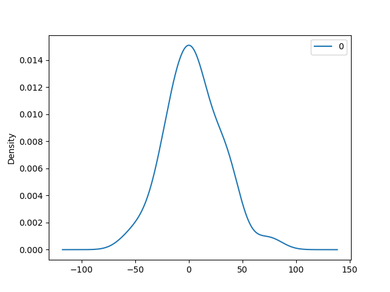
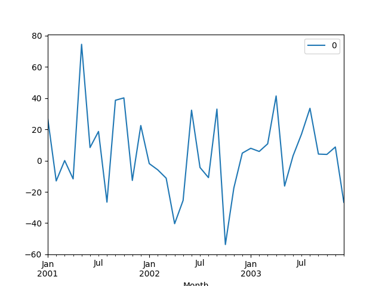
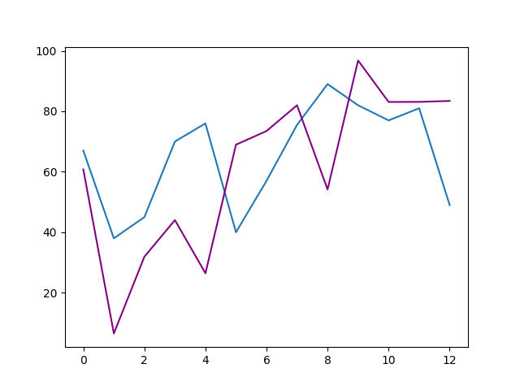

# ARIMA Time Series Prediction

ARIMA is a forecasting algorithm that stands for 'AutoRegressive 
Integrated Moving Average'. it is a class of statistical models for 
analyzing and forecasting time series data. The ARIMA
model is defined by three Values namely: p, d, and q.

* [How to Create an ARIMA Model for Time Series Forecasting in Python](https://machinelearningmastery.com/arima-for-time-series-forecasting-with-python/) [@www-time-series-analysis-guide]

* [ARIMA Model – Complete Guide to Time Series Forecasting in Python](https://www.machinelearningplus.com/time-series/arima-model-time-series-forecasting-python/#:~:text=ARIMA%2C%20short%20for%20'AutoRegressive%20Integrated,to%20predict%20the%20future%20values.) [@www-arima]

where:

The order of the AR term is denoted by p.

The order of the MA term is denoted by q.

The differencing required to make the time series stationary is denoted by d.

## So, how do you make a series stationary?

The most common method is to differentiate it. To put it another way,
subtract the previous value from the current value. Depending on the 
complexity of the series, more than one differencing may be required at times.

As a result, the value of d is the smallest number of differences 
required to make the series stationary. And d = 0 if the time series
is already stationary.

## What exactly are AR and MA models?

A pure Auto Regressive (AR only) model is one in which Yt is solely 
determined by its lags. That is, Yt is a function of the 'Yt lags.'

$$Y_t = \alpha +\beta_1 Y_{t-1} + \beta_2 Y_{t-2}+ ... +\beta_p Y_{t-p} + \epsilon_1$$

'where $Yt-1$ is the series' lag1, $beta1$ is the lag1 coefficient 
estimated by the model, and $alpha$ is the intercept term 
estimated by the model.'


Similarly, a pure Moving Average (MA only) model is one in which Yt 
is determined solely by the lagged forecast errors.

$$Y_t = \alpha +\epsilon_t + \phi_1 \epsilon_{t-1} + \phi_2 \epsilon_{t-2} ... + \phi_q \epsilon_{t-q}$$

An ARIMA model is one in which the time series is different at least 
once to make it stationary and the AR and MA terms are combined. As a 
result, the equation is:

$$Y_t = \alpha +\beta 1Y_{t-1} + \beta 2Y_{t-2} + ... + \beta pY_{t-p}\epsilon t + \phi 1\epsilon t-1+\phi 2\epsilon t-2+...+\phi q \epsilon t-q$$

$$Predicted Yt = Constant + Linear combination Lags of Y (upto p lags) + 
Linear Combination of Lagged forecast errors (upto q lags)$$

### ARIMA Python Implementation

The following example showcase the ARIMA Model. It is copied from [@www-time-series-analysis-guide]

```python
from datetime import datetime
from pandas import read_csv
from pandas import DataFrame
from statsmodels.tsa.arima.model import ARIMA
from matplotlib import pyplot


# load dataset
def parser(x):
    return datetime.strptime('200' + x, '%Y-%m')


series = read_csv('https://raw.githubusercontent.com/cybertraining-dsc/su22-reu-385/main/time-series-prediction/temperature2.csv', 
                  header=0, index_col=0, parse_dates=True, squeeze=True, date_parser=parser)
series.index = series.index.to_period('M')
# fit model
model = ARIMA(series, order=(5, 1, 0))
model_fit = model.fit()
# summary of fit model
print(model_fit.summary())
# line plot of residuals
residuals = DataFrame(model_fit.resid)
residuals.plot()
pyplot.show()
# density plot of residuals
residuals.plot(kind='kde')
pyplot.show()
# summary stats of residuals
print(residuals.describe())
```
{fig:Arima Model}

 {fig:Arima Model}

Figure @fig:Arima Model shows two graphs that give a visual explanation of the ARIMA models.

## Rolling Forecast ARIMA Model

Given the observations in previous time steps for 
differencing and the AR model, a rolling forecast is required.
The ARIMA model is created after each new observation, which 
is a crude way to perform this rolling forecast.

Each iteration, we manually keep track of all observations in a 
list called history, which is seeded with the training data 
and to which new observations are appended.

Putting it all together, here's an example of a rolling forecast
in Python using the ARIMA model.

The following example showcase the Rolling Forecasting ARIMA model. It is copied from [@www-time-series-analysis-guide]

```python
from pandas import read_csv
from pandas import datetime
from matplotlib import pyplot
from statsmodels.tsa.arima.model import ARIMA
from sklearn.metrics import mean_squared_error
from math import sqrt


# load dataset
def parser(x):
    return datetime.strptime('190' + x, '%Y-%m')


series = read_csv('https://raw.githubusercontent.com/cybertraining-dsc/su22-reu-385/main/time-series-prediction/temperature2.csv', 
                  header=0, index_col=0, parse_dates=True, squeeze=True, date_parser=parser)
series.index = series.index.to_period('M')
# split into train and test sets
X = series.values
size = int(len(X) * 0.66)
train, test = X[0:size], X[size:len(X)]
history = [x for x in train]
predictions = list()
# walk-forward validation
for tes in range(len(test)):
    model = ARIMA(history, order=(6, 2, 0))
    model_fit = model.fit()
    output = model_fit.forecast()
    predictions.append(output[0])
    obs = test[tes]
    history.append(obs)
    print('predicted=%f, expected=%f' % (output[0], obs))
# evaluate forecasts
rmse = sqrt(mean_squared_error(test, predictions))
print('Test RMSE: %.3f' % rmse)
# plot forecasts against actual outcomes
pyplot.plot(test)
pyplot.plot(predictions, color='purple')
pyplot.show()
```
above is a line plot is created showing the expected values (blue) 
compared to the rolling forecast predictions (purple)

{fig:Rolling Forecasting}

Figure @fig:Rolling Forecasting shows a graph that give a visual explanation of the rolling forecasting ARIMA models.
it shows the relationship between the expected value and the prediction.

Example programs to showcase specific features are listed next::

* [ARIMA Time Series prediction, arima-prediction.py](https://github.com/cybertraining-dsc/su22-reu-385/blob/main/time-series-prediction/arima/arima-prediction.py)

* [Rolling ForeCasting Model, rolling-forecast-arima.py](https://github.com/cybertraining-dsc/su22-reu-385/blob/main/time-series-prediction/arima/rolling-forecast-arima.py)
