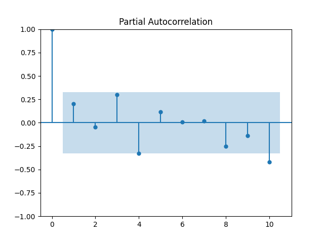

# Autocorrelation in images/Time Series

This is the degree of similarity between a given time series and a lagged version of 
itself over successive time intervals is referred to as autocorrelation. In 
other words, autocorrelation is used to assess the relationship between a 
variable's current value and any previous values to which you have access.

* [Autocorrelation in Time Series Data](https://www.influxdata.com/blog/autocorrelation-in-time-series-data/#:~:text=The%20term%20autocorrelation%20refers%20to,you%20may%20have%20access%20to.)[@www-autocorrelation]

* [A Gentle Introduction to Autocorrelation and Partial Autocorrelation](https://machinelearningmastery.com/gentle-introduction-autocorrelation-partial-autocorrelation/)[@www-autocorrelation-partial]

The following example showcase the Autocorrelation of time series. It is copied from [@www-autocorrelation-partial]

```python
from pandas import read_csv
from matplotlib import pyplot
from statsmodels.graphics.tsaplots import plot_acf
series = read_csv('https://raw.githubusercontent.com/cybertraining-dsc/su22-reu-385/main/time-series-prediction/temperature2.csv', header=0, index_col=0)
plot_acf(series)
pyplot.show()
```

{fig:autocorrelation}

Figure @fig:Arima Model shows a graphs that give a visual explanation of the autocorellation of a time series
these output show the correllation between the dataset provided above.

## Partial Autocorrelation Function

partial correlation unlike autocorrelation the partial auto correlation
deals with the relationship between an observation presently and a previous 
observation not taking into consideration the middle observation. the middle 
observation depends on the lag value it the value tell us the amount of time period 
to be delayed.

The following example showcase the Partial AutoCorrelation of Time series. It is copied from [@www-autocorrelation-partial]

```python
from pandas import read_csv
from matplotlib import pyplot
from statsmodels.graphics.tsaplots import plot_pacf
temp = read_csv('https://raw.githubusercontent.com/cybertraining-dsc/su22-reu-385/main/time-series-prediction/temperature2.csv', header=0, index_col=0)
plot_pacf(temp, lags=10)
pyplot.show()
```

{fig:partial}

Figure @fig:partial shows a graphs that give a visual explanation of 
the partial auto correlation with a lag value of 10

Example programs to showcase specific features are listed next:

* [AutoCorrelation, autocorrelation.py](https://github.com/cybertraining-dsc/su22-reu-385/blob/main/time-series-prediction/autocorrelation/autocorrelation.py)

* [Partial AutoCorrelation, partialautocorrelation.py](https://github.com/cybertraining-dsc/su22-reu-385/blob/main/time-series-prediction/autocorrelation/partialautocorrelation.py)
