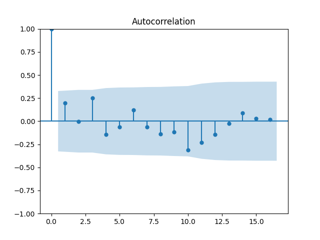
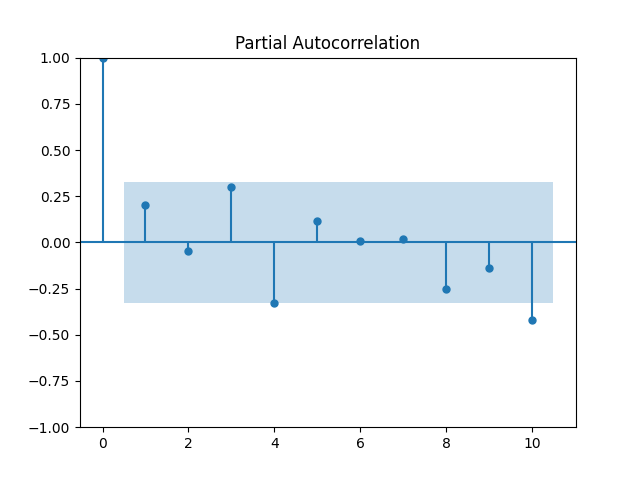

Extensive documents on autocorrelation of Time Series are available at

* <https://www.influxdata.com/blog/autocorrelation-in-time-series-data/#:~:text=The%20term%20autocorrelation%20refers%20to,you%20may%20have%20access%20to.>

* <https://machinelearningmastery.com/gentle-introduction-autocorrelation-partial-autocorrelation/>

# Autocorrelation in Time Series

The degree of similarity between a given time series and a lagged version of 
itself over successive time intervals is referred to as autocorrelation. In 
other words, autocorrelation is used to assess the relationship between a 
variable's current value and any previous values to which you have access.

Example idea gotten from [2]

```python
from pandas import read_csv
from matplotlib import pyplot
from statsmodels.graphics.tsaplots import plot_acf
series = read_csv('https://raw.githubusercontent.com/cybertraining-dsc/su22-reu-385/main/time-series-prediction/temperature2.csv', header=0, index_col=0)
plot_acf(series)
pyplot.show()
```


## Partial Autocorrelation Function

partial correlation unlike autocorrelation the partial auto correlation
deals with the relationship between an observation presently and a previous 
observation not taking into consideration the intervening observation.

Example idea gotten from [2]
```python
from pandas import read_csv
from matplotlib import pyplot
from statsmodels.graphics.tsaplots import plot_pacf
temp = read_csv('https://raw.githubusercontent.com/cybertraining-dsc/su22-reu-385/main/time-series-prediction/temperature2.csv', header=0, index_col=0)
plot_pacf(temp, lags=10)
pyplot.show()
```


## Reference
* [1] <https://www.influxdata.com/blog/autocorrelation-in-time-series-data/#:~:text=The%20term%20autocorrelation%20refers%20to,you%20may%20have%20access%20to.>

* [2] <https://machinelearningmastery.com/gentle-introduction-autocorrelation-partial-autocorrelation/>
