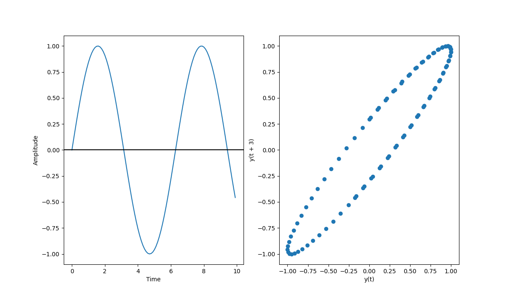

Extensive Documents on lag plot can be found 

* <https://www.geeksforgeeks.org/lag-plots/>

# Lag Plot

A lag plot is a type of scatter plot in which the X-axis 
represents the dataset behind or ahead of the Y-axis by some
time units. The difference in time units is known as lag or
lagged, and it is represented by the symbol k.

The following axes are included in the lag plot:

Vertical axis: $$y_i$$ for all i
Horizontal axis: $$y_{i-k}$$ for all i where k represents the lag value.

The lag plot can be used in answering the following questions:

## Model Distribution

Model Distribution means deciding the shape of the data on 
the lag plot.

## Outliers

Outliers are data points that can be regarded as the extreme value 
in the distribution of the lag plot

## Randomness in data

lag plot also shows the randomness of data if the plot seems random 
it will reflect in the lag plot.

## Seasonality

If there is seasonality present in the lag-plot, it will give a periodic lag
plot.

## Autocorrelation

When the lag plot produces a linear plot, it indicates that autocorrelation exists 
in the data; whether it is positive or negative depends on the slope of the dataset's
line.

Example Formatted from [1]

``` python
# Import Libraries
import pandas as pd
import numpy as np
import matplotlib.pyplot as plt
from scipy import stats as sc

# Sine graph and lag plot
time = np.arange(0, 10, 0.1);
amplitude = np.sin(time)
fig, ax = plt.subplots(1, 2, figsize=(12, 7))
ax[0].plot(time, amplitude)
ax[0].set_xlabel('Time')
ax[0].set_ylabel('Amplitude')
ax[0].axhline(y=0, color='k')
amplitude_series = pd.Series(amplitude)
pd.plotting.lag_plot(amplitude_series, lag=3, ax=ax[1])
plt.show()

# Random and Lag Plot
sample_size = 100
fig, ax = plt.subplots(1, 2, figsize=(12, 7))
random_series = pd.Series(np.random.normal(size=sample_size))
random = random_series.reset_index(inplace=True)
ax[0].plot(random['index'], random[0])
pd.plotting.lag_plot(random[0], lag=1)
plt.show()

temp_data = pd.read_csv('https://raw.githubusercontent.com/cybertraining-dsc/su22-reu-385/main/time-series-prediction/temperature2.csv')
temp_data.reset_index(inplace=True)
fig, ax = plt.subplots(1, 2, figsize=(12, 7))
ax[0].plot(temp_data['Adj Close'], temp_data['index'])
pd.plotting.lag_plot(temp_data['Adj Close'], lag=1, ax=ax[1])
plt.show()
```


To test the following code:

* <https://github.com/cybertraining-dsc/su22-reu-385/blob/main/time-series-prediction/lag-plot/lag-plot.py>

## Reference

* [1] <https://www.geeksforgeeks.org/lag-plots/>
