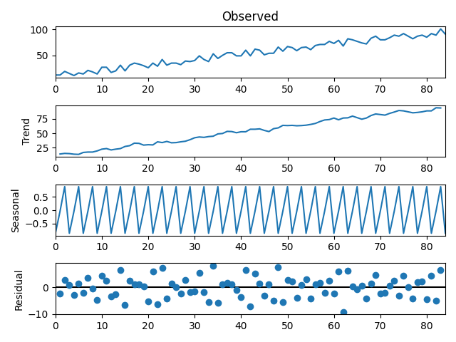

## Seasonal decomposition from stats model
Decomposing a time series entails viewing it as a collection of
level, trend, seasonality, and noise components.

There are methods for decomposing a time series automatically.

In a function called `seasonal_decompose()`, the statsmodels library implements the naive, or classical, 
decomposition method. You must specify whether the model is additive or multiplicative.

### Additive Decomposition

An additive model suggests that the components are added together as follows:

```
y(t) = Level + Trend + Seasonality + Noise
```

An additive model is linear where changes over time are consistently made by the same amount.

A linear trend is a straight line.

A linear seasonality has the same frequency (width of cycles) and amplitude (height of cycles).

We can decompose a time series made up of a linearly increasing trend from 1 to 99 and random noise 
as an additive model.

```python
from random import randrange
from pandas import Series
from matplotlib import pyplot
from statsmodels.tsa.seasonal import seasonal_decompose
series = [i+randrange(10) for i in range(1,100)]
result = seasonal_decompose(series, model='additive', period=1)
result.plot()
pyplot.show()
```



### Multiplicative Decomposition

A multiplicative model suggests that the components are multiplied together as follows:
```
y(t) = Level * Trend * Seasonality * Noise
```
Nonlinear models, such as quadratic or exponential, are multiplicative. Changes grow or shrink over time.

A curved line represents a nonlinear trend.

The frequency and/or amplitude of a non-linear seasonality increase or decrease over time.

We can create a quadratic time series by taking the square of the time step from 1 to 99 and decomposing 
it using a multiplicative model.

```python
from pandas import Series
from matplotlib import pyplot
from statsmodels.tsa.seasonal import seasonal_decompose
series = [i**2.0 for i in range(1,100)]
result = seasonal_decompose(series, model='multiplicative', period=1)
result.plot()
pyplot.show()
```


Reference: https://machinelearningmastery.com/decompose-time-series-data-trend-seasonality/#:~:text=The%20statsmodels%20library%20provides%20an,model%20is%20additive%20or%20multiplicative.