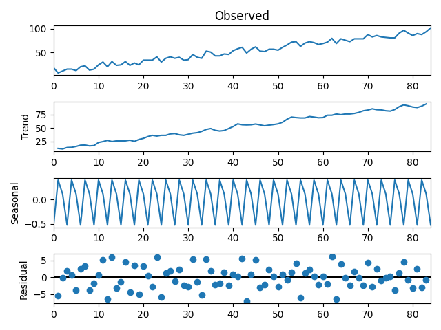

An extensive documentation on seasonal decomposition of stat model is
available At

* <https://machinelearningmastery.com/decompose-time-series-data-trend-seasonality/#:~:text=The%20statsmodels%20library%20provides%20an,model%20is%20additive%20or%20multiplicative.>

## Seasonal decomposition from stats model

Decomposing a time series entails viewing it as a collection of
level, trend, seasonality, and noise components. it uses
a function called `seasonal_decompose()`, the statsmodels library 
implements the naive, or classical, decomposition method. You must 
specify whether the model is additive or multiplicative.

### Additive Decomposition

An additive model deals with components being added together as 
follows:

$$ y(t) = Level + Trend + Seasonality + Noise $$

We can decompose a time series that are made up of a linearly increasing trend from
1 to 99,and random noise as an additive model.

This example was edited from [1]

```python
from random import randrange
from matplotlib import pyplot
from statsmodels.tsa.seasonal import seasonal_decompose
serie = [i+randrange(15) for i in range(5,90)]
result = seasonal_decompose(serie, model='additive', period=3)
result.plot()
pyplot.show()
```


### Multiplicative Decomposition

A multiplicative model deals with components being multiplied together as 
follows:

$$ y(t) = Level * Trend * Seasonality * Noise $$

Nonlinear models, include are quadratic or exponential, are multiplicative. 
Changes grow or shrink over time. A curved line represents a nonlinear trend.
The frequency and/or amplitude of a non-linear seasonality increase or decrease
over time.

We can create a quadratic time series by using the square of the time step from 
1 to 99 and decomposing it using a multiplicative model.

This example was edited from [1]

```python
from matplotlib import pyplot
from statsmodels.tsa.seasonal import seasonal_decompose

series = [i ** 4.0 for i in range(10, 150)]
result = seasonal_decompose(series, model='multiplicative', period=2)
result.plot()
pyplot.show()

```


### References

 * [1] How to Decompose Time Series Data into Trend and Seasonality  <https://machinelearningmastery.com/decompose-time-series-data-trend-seasonality/#:~:text=The%20statsmodels%20library%20provides%20an,model%20is%20additive%20or%20multiplicative.>
