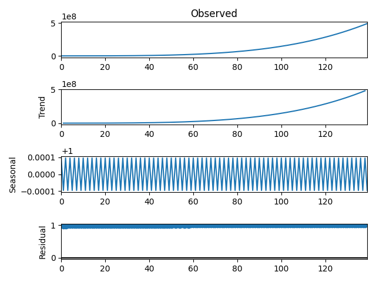
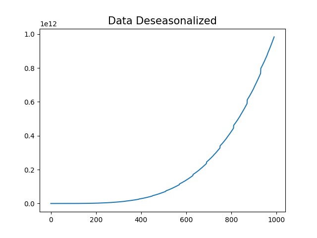

# Seasonal decomposition from stats model

An extensive documentation on seasonal decomposition and deseasonalising of stat model is
available at

* <https://www.machinelearningplus.com/time-series/time-series-analysis-python/>

* <https://machinelearningmastery.com/decompose-time-series-data-trend-seasonality/#:~:text=The%20statsmodels%20library%20provides%20an,model%20is%20additive%20or%20multiplicative.>


Decomposing a time series entails viewing it as a collection of
level, trend, seasonality, and noise components. it uses
a function called `seasonal_decompose()`, the statsmodels library 
implements the naive, or classical, decomposition method. You must 
specify whether the model is additive or multiplicative.

## Additive Decomposition

An additive model deals with components being added together as 
follows:

$$ y(t) = Level + Trend + Seasonality + Noise $$

We can decompose a time series that are made up of a linearly increasing trend from
1 to 99,and random noise as an additive model.

Example Formatted from [1]

```python
from random import randrange
from matplotlib import pyplot
from statsmodels.tsa.seasonal import seasonal_decompose
data = [i+randrange(15) for i in range(5,90)]
result = seasonal_decompose(data, model='additive', period=3)
result.plot()
pyplot.show()
```

{#fig:additive}

## Multiplicative Decomposition

A multiplicative model deals with components being multiplied together as 
follows:

$$ y(t) = Level * Trend * Seasonality * Noise $$

Nonlinear models, include are quadratic or exponential, are multiplicative. 
Changes grow or shrink over time. A curved line represents a nonlinear trend.
The frequency and/or amplitude of a non-linear seasonality increase or decrease
over time.

We can create a quadratic time series by using the square of the time step from 
1 to 99 and decomposing it using a multiplicative model.

Example Formatted from [1]

```python
from matplotlib import pyplot
from statsmodels.tsa.seasonal import seasonal_decompose

data = [i ** 4.0 for i in range(10, 150)]
result = seasonal_decompose(data, model='multiplicative', period=2)
result.plot()
pyplot.show()

```
{#fig:multiplicative}

## Desasonalising of Time Series

This is process of removing seasonality from time series 

There are several methods for deseasonalising a time series. Here are a few :

* Take a moving average with length as the seasonal window. This will smoothen in series in the process.

* Seasonal difference the series (subtract the value of previous season from the current value)

* Divide the series by the seasonal index obtained from STL decomposition

Example Formatted from [1],[2]

```python
from matplotlib import pyplot as plt
from statsmodels.tsa.seasonal import seasonal_decompose

df = [i ** 4.0 for i in range(10, 1000)]

# Time Series Decomposition
result_mul = seasonal_decompose(df, model='multiplicative', period=60)

# Deseasonalize
deseasonalized = df / result_mul.seasonal

# Plot
plt.plot(deseasonalized)
plt.title('Data Deseasonalized', fontsize=15)
plt.show()
```

{#fig:deseasonalizing}

Test the following codes below:

* Additive Decomposition <https://github.com/cybertraining-dsc/su22-reu-385/blob/main/time-series-prediction/seasonal-decomposition/additive-decomposition.py>

* Multiplicative Decomposition <https://github.com/cybertraining-dsc/su22-reu-385/blob/main/time-series-prediction/seasonal-decomposition/multiplicative-decomposition.py>

* Deseasonalize  <https://github.com/cybertraining-dsc/su22-reu-385/blob/main/time-series-prediction/seasonal-decomposition/deseasonalize.py>

## References

* [1] How to Decompose Time Series Data into Trend and Seasonality  <https://machinelearningmastery.com/decompose-time-series-data-trend-seasonality/#:~:text=The%20statsmodels%20library%20provides%20an,model%20is%20additive%20or%20multiplicative.>

* [2] <https://www.machinelearningplus.com/time-series/time-series-analysis-python/>


