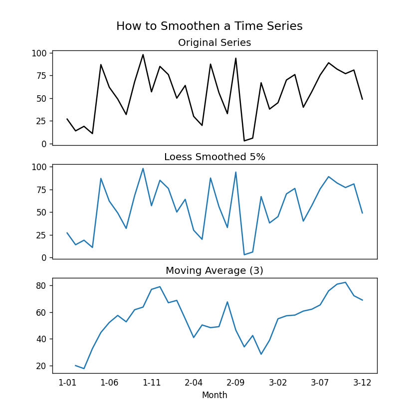

# Smoothen

Smoothing is a technique used to remove fine-grained variation
between time steps in time series. So, how do you smooth out a 
series? Let us now look at the following method.

Extensive documents on Smoothen are available at

* <https://www.machinelearningplus.com/time-series/time-series-analysis-python/>

* <https://machinelearningmastery.com/moving-average-smoothing-for-time-series-forecasting-python/#:~:text=Smoothing%20is%20a%20technique%20applied,of%20the%20underlying%20causal%20processes.>

* Take a Moving Average

* Do a LOESS smoothing (Localized Regression)

* Do a LOWESS smoothing (Locally Weighted Regression)

## Take a Moving Average

A moving average is simply the average of a fixed-width rolling window. 
However, you must choose the window width carefully because a large window 
will over-smooth the series.

## LOESS smoothing (Localized Regression)

LOESS, which stands for 'LOcalized regrESSion,' fits multiple regressions
in each point's local neighborhood. It is implemented in the `statsmodels`
package, and the degree of smoothing can be controlled using the `frac` argument.

Example from [2] @smoothing

```python
import numpy as np
import pandas as pd
from matplotlib import pyplot as plt
from statsmodels.nonparametric.smoothers_lowess import lowess

plt.rcParams.update({'xtick.bottom': False, 'axes.titlepad': 5})

# Import
df_orig = pd.read_csv(
    'https://raw.githubusercontent.com/cybertraining-dsc/su22-reu-385/main/time-series-prediction/temperature2.csv',
    parse_dates=['Month'], index_col='Month')

# 1. Moving Average
df_ma = df_orig.Temperature.rolling(3, center=True, closed='both').mean()

# 2. Loess Smoothing (5%)
df_loess_5 = pd.DataFrame(lowess(df_orig.Temperature, np.arange(len(df_orig.Temperature)), frac=0.05)[:, 1],
                          index=df_orig.index, columns=['Temperature'])


# Plot
fig, axes = plt.subplots(3, 1, figsize=(7, 7), sharex=True, dpi=120)
df_orig['Temperature'].plot(ax=axes[0], color='k', title='Original Series')
df_loess_5['Temperature'].plot(ax=axes[1], title='Loess Smoothed 5%')
df_ma.plot(ax=axes[2], title='Moving Average (3)')
fig.suptitle('How to Smoothen a Time Series', y=0.95, fontsize=14)
plt.show()
```

{fig:smoothen}

Figure @fig:smoothen shows a graphs that give a visual explanation on smoothen a time series.

Test the following code below:

* <https://github.com/cybertraining-dsc/su22-reu-385/blob/main/time-series-prediction/smothen/smothen.py>

## Reference

* [1] @time-series-analysis-guide <https://www.machinelearningplus.com/time-series/time-series-analysis-python/>

* [2] @smoothing <https://machinelearningmastery.com/moving-average-smoothing-for-time-series-forecasting-python/#:~:text=Smoothing%20is%20a%20technique%20applied,of%20the%20underlying%20causal%20processes.>