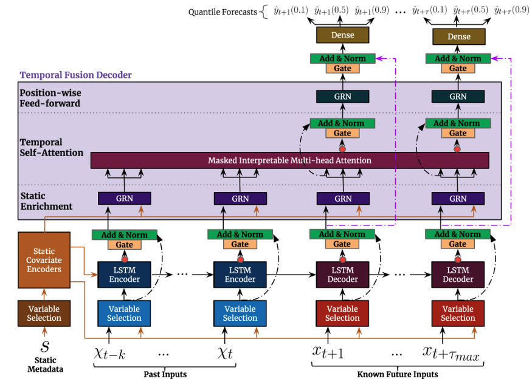

An extensive documentation on Temporal Fusion Transformer are Available at

* <https://arxiv.org/abs/1912.09363>

* <https://towardsdatascience.com/temporal-fusion-transformer-googles-model-for-interpretable-time-series-forecasting-5aa17beb621>

# Temporal Fusion Transformer(TFT)

TFT is an attention-based Deep Neural Network that has been 
optimized for performance and interpretability. To learn 
temporal dependencies, the TFT employs recurrent layers for 
local processing and interpretable self-attention layers.
relationships at different scales TFT also employs specialized 
components.

## Advantages of Temporal Fusion Transformer

### Rich features

The Temporal Fusion Transformer support 3 feature which includes:
temporal data with known inputs into the future,temporal data
known only up to the present, and the time-invariant features

### Heterogeneous time series

The TFT architecture split processing into two part: Local processing
focuses on specific event characteristics, whereas global processing 
captures the collective characteristics of all time series.

### Multi-horizon forecasting

TFT produces prediction intervals in addition to the actual prediction 
by utilizing the quantile loss function.

### Interpretability

The TFT a transformers based architecture. This model presents a novel Muti 
Head attention mechanism that, when analyzed, provides additional insight on
feature importance by utilizing self-attention.

### High Performance

TFT outperformed traditional statistical models (ARIMA) as well as DeepAR, 
MQRNN, and Deep Space-State Models (DSSM)

### Documentation

There are already open source TFT implementations in Tensorflow and Python.

Example from [2]

The Figure below shows the Top level Architecture of Temporal Fusion Transformer 

## How Does Temporal Fusion Transformer Works  

### References

* [1] Temporal Fusion Transformers for Interpretable Multi-horizon Time Series Forecasting <https://arxiv.org/abs/1912.09363>

* [2] <https://towardsdatascience.com/temporal-fusion-transformer-googles-model-for-interpretable-time-series-forecasting-5aa17beb621>